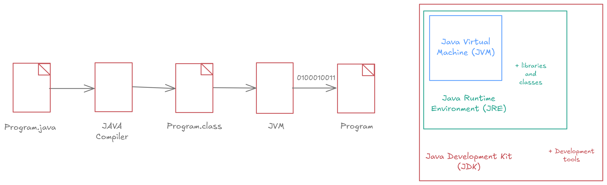
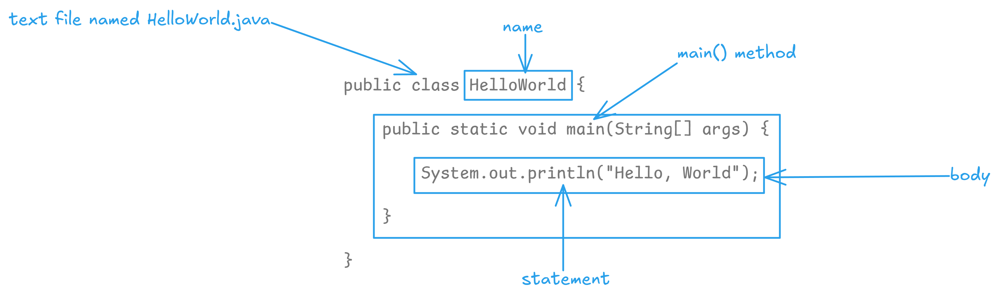
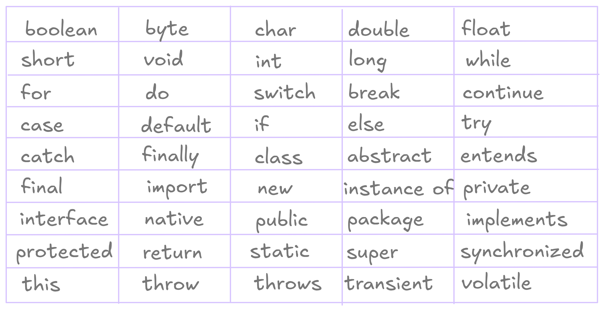
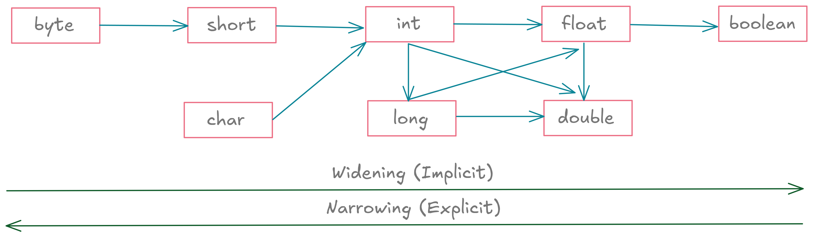

# Java Basics

**Java** is a high-level, Object-Oriented Programming language known for its **platform independence**, **performance**, and **wide applicability**.

> *Key traits of Java: portability (WORA), high performance (JIT), broad usage (web, mobile, enterprise).*

## Programming Language

A **programming language** like **Java** is a medium that allows **humans to communicate with computers** by writing instructions in a structured and logical way, following a defined set of **rules** known as **syntax**.

> *Syntax ensures **human–machine interpretability** by translating only **syntactically correct** code. While humans think in logic and symbols, computers think in **electrical signals (on/off)** — represented as **1s and 0s**.*

## Program Execution Flow

A **Java program** goes through multiple stages before execution. Java programs are written using **Java syntax** and saved with the **`.java`** file extension.

The **Java Compiler (`javac`)** translates the `.java` source file into a **`.class` file** that contains **bytecode**. **Bytecode** is an **intermediate, platform-independent** representation of the program. It is **not binary (0s and 1s)** and cannot be executed directly by the CPU.

The **JVM (Java Virtual Machine)** loads and executes the bytecode.

*Write `Hello.java` → Compile `javac Hello.java` → produces `Hello.class` → Run `java Hello` → Output `Hello, Java!`*

>  *`.java` files must be **compiled** before execution, as the compiler checks for syntax errors during this phase. If any exist, compilation stops, and no `.class` file is created. The JVM ensures **portability** — meaning the same `.class` file can run on any OS (Windows, macOS, Linux) as long as a JVM is available.*

> *For running (`java Hello`), only the **JRE** is needed. For developing and compiling (`javac Hello.java`), the **JDK** is required.*

<p align="center">
  
</p>

1. **JVM (Java Virtual Machine)** is an **abstract machine** responsible for running Java programs.

2. **JRE (Java Runtime Environment)** includes the **JVM**, **core libraries**, and other necessary files to **run** Java applications.

3. **JDK (Java Development Kit)** is a **complete development package** that contains **JRE**, **JVM**, and development tools such as `javac`, `javadoc`, `jdb`.

> *You need **JRE** to **run** existing Java programs and **JDK** to **develop and compile** Java applications.*

## Basic Java Program

<p align="center">
  
</p>

## Keywords

**Java keywords** are **predefined, reserved words** that have **special meanings** in the Java language.

> *Keywords **cannot be used** as identifiers — that means you cannot use them as variable names, class names, or method names. If you try to use a keyword as an identifier (e.g., naming a variable `class` or `static`), the compiler will throw a **syntax error**. Java currently defines **50 reserved keywords**.*

<p align="center">
  
</p>

## Variable

A **variable** in Java is a **named memory location** that stores a value.

In programming, a **program** is essentially a **sequence of operations** that manipulate data using **operators** and **variables**. You access and modify **data indirectly** through variables, not by dealing with raw memory values.

>  *The term *“variable”* comes from the fact that its **value can change** while the program runs. Variables are **not the actual data**, but **references** to the memory locations holding the data.*

**Naming Rules:**

* Case-sensitive (eg. *age* ≠ *Age*).
* Must start with letter, `_`, or `$`.
* No whitespace allowed.
* Cannot use Java keywords.

```java
public class VariableRulesExample {
    public static void main(String[] args) {
        int age = 25;
        int Age = 30;
        // System.out.println(AGE); // invalid
        System.out.println("age: " + age + ", Age: " + Age);
        
        int number = 5;
        int _count = 10;
        int $price = 100;
        // int 1number = 5; // invalid
        // int @rate = 50; // invalid
        // int #marks = 90; // invalid
        System.out.println("number: " + number + ", _count: " + _count + ", $price: " + $price);
        
        int totalAmount = 500;
        // int total amount = 500; // invalid
        System.out.println("totalAmount: " + totalAmount);
        
        int classNumber = 10;
        // int class = 10; // invalid
        // int public = 5; // invalid
        System.out.println("classNumber: " + classNumber);
    }
}
```

## Data Types

In Java, **data types** define the **type of data** a variable can store and the **amount of memory** it occupies.

Java data types are broadly classified into two main categories:

* **Primitive Data Types**: These are the most basic built-in data types that hold simple values directly in memory, eg. `int`, `boolean`, `char`, `double`.
* **Non-Primitive (Reference) Data Types**: These store references (addresses) of objects, not actual values, eg. `String`, `Array`, `Class`, `Interface`.

> *Every variable in Java must have a **declared data type**, making Java a **strongly typed language**. The **8 primitive data types** are the **core building blocks** — all complex data types (like classes or arrays) are built upon them.*

| **Data Type** | **Size** | **Default** | **Range / Precision**                                  | **Description**                |
| ------------- | -------- | ----------- | ------------------------------------------------------ | ------------------------------ |
| **boolean**   | 1 bit    | false       | —                                                      | Stores true/false values       |
| **byte**      | 1B / 8b  | 0           | -128 → 127                                             | Small whole numbers            |
| **short**     | 2B / 16b | 0           | -32,768 → 32,767                                       | Whole numbers                  |
| **int**       | 4B / 32b | 0           | -2,147,483,648 → 2,147,483,647                         | Whole numbers                  |
| **long**      | 8B / 64b | 0L          | -9,223,372,036,854,775,808 → 9,223,372,036,854,775,807 | Large whole numbers            |
| **float**     | 4B / 32b | 0.0f        | ≈6–7 decimal digits                                    | Fractional numbers             |
| **double**    | 8B / 64b | 0.0d        | ≈15 decimal digits                                     | Fractional numbers             |
| **char**      | 2B / 16b | '\u0000'    | Unicode 0–65,535                                       | Single character / ASCII value |

```java
public class PrimitiveDataTypesExample {
    public static void main(String[] args) {
        boolean boolVar = true;
        System.out.println("boolean: " + boolVar);

        byte byteVar = 100;
        System.out.println("byte: " + byteVar);

        short shortVar = 20000;
        System.out.println("short: " + shortVar);

        int intVar = 500000;
        System.out.println("int: " + intVar);

        long longVar = 9000000000L; // ‘L’ suffix for long literals
        System.out.println("long: " + longVar);

        float floatVar = 5.75f; // ‘f’ suffix for float literals
        System.out.println("float: " + floatVar);

        double doubleVar = 19.99;
        System.out.println("double: " + doubleVar);

        char charVar = 'A';
        System.out.println("char: " + charVar);
    }
}
```

## Type Conversion

*Data Type Conversion* in Java is the process of changing a variable’s data type from one form to another.

Type Conversion in Java can be categorized into two main types: 

**1. Implicit Conversion (Widening / Type Promotion)**: Also called **automatic conversion**, this happens when a **smaller data type is converted to a larger data type** automatically by the compiler, eg. `byte → int` (automatic conversion) 

*(**Analogy:** Think of it as pouring water from a small bucket into a large one — safe and no loss.)*

**2. Explicit Conversion (Type Casting / Narrowing)**: Also called **manual conversion**, this is when a **larger data type is converted to a smaller data type**. The programmer must explicitly specify the target type using **type casting**, eg. `double → int` (manual casting).

*(**Analogy:** Think of pouring water from a large bucket into a small one — some may spill (data loss).)*

> *Implicit Conversion is also called **type promotion** because the smaller type is "promoted" to a larger one. **Safe operation** — no data loss or errors.*

> *In Explicit Conversion, always ensure explicit casting is done only when necessary. **May cause data loss**, overflow, or precision loss.*

<p align="center">
  
</p>

```java
public class TypeConversionExample {
    public static void main(String[] args) {
        // IMPLICIT (Widening) | Small → Big | Safe and automatic
        int smallBucket = 100; // int = 4 bytes
        double bigBucket = smallBucket; // double = 8 bytes
        System.out.println("int: " + smallBucket);
        System.out.println("double: " + bigBucket);

        // EXPLICIT (Narrowing) | Big → Small | Manual and risky
        double largeBucket = 99.99;
        int tinyBucket = (int) largeBucket;
        System.out.println("double: " + largeBucket);
        System.out.println("int: " + tinyBucket);
    }
}
```

## Comments

*Comments* in Java are lines of text within a program that are **ignored by the compiler**. Comments make code more readable, maintainable, and easier for others (or your future self) to understand.

> *Comments are only for humans — the compiler completely skips them during execution.*


